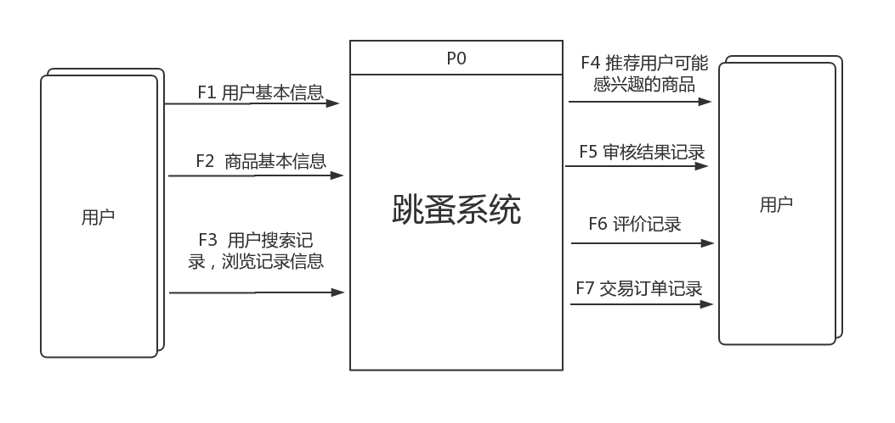
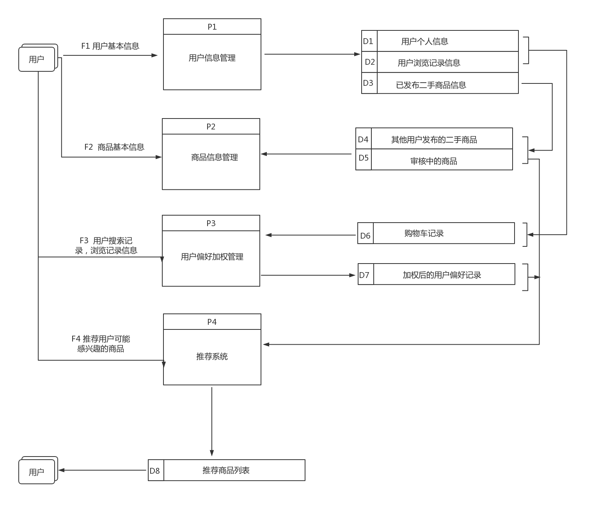
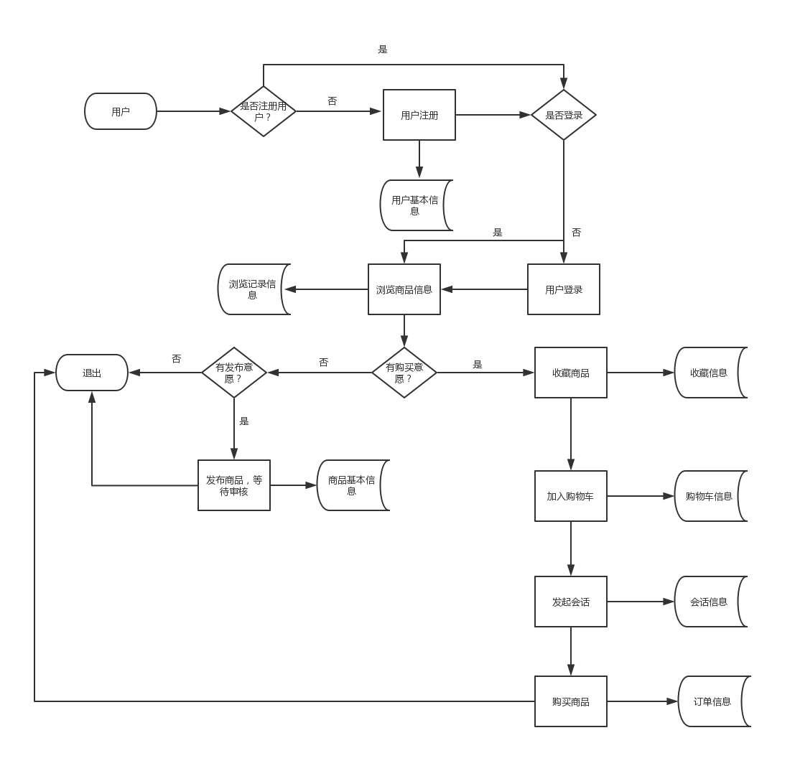
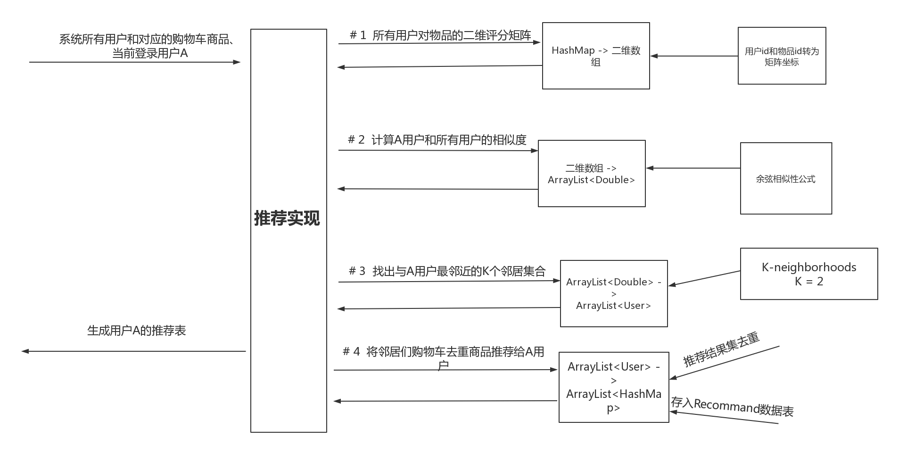

# 基于协同过滤算法的校园跳蚤系统的设计与实现

done  

本项目基于[https://github.com/veekxt/hfuu_shop](https://github.com/veekxt/hfuu_shop)  
在原项目基础上添加了基于用户的推荐功能，实现代码为 `UserCF.java` 文件  
具体过程有空再更

## 关联图

## 顶层数据流程图

## 业务流程图

## 推荐算法实现

